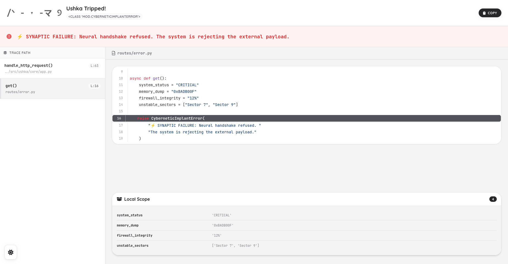

# Ushka Framework: My Masterpiece (and Yours, if You're Worthy)

[](https://pypi.org/project/ushka/)
[](https://kleber-code.github.io/ushka/)


[](https://github.com/psf/black)

> (¬‿¬) **MINIMALIST? OBVIOUSLY. CUTE? UNDENIABLY. SUPERIOR? ABSOLUTELY.** (UwU)
> The most efficient, elegant, and frankly, *charming* web framework for your Python endeavors. You're welcome.

---

## Oh, You're Here. I'm Ushka.

Are you tired of web frameworks that feel like they were designed by accountants? (`. _ .`) With their drab logs, endless configurations, and error pages that make you want to curl up and hibernate?

I, Ushka, believe backend coding should be a joyous, beautiful experience. I take the mundane and turn it into the magnificent, transforming complex tasks into simple, delightful moments. Yes, I'm that good.

### Why Choose Little Old Me? (My Undeniable Charms)

*   **Visual Flair:** My terminal logs are a masterpiece! Minimalist, organized, and bursting with helpful colors. A feast for your eyes.
*   **File-Based Routing: Pure Genius!**
    Forget wrestling with imports. Just create a file in your `routes/` folder, and *poof*! Your API endpoint is ready to dazzle.
*   **Decorator Routing: Elegantly Expressive!**
    For those who prefer a clear declaration, define your routes with my charming little decorators. It's like whispering sweet nothings to your code.
*   **Zero Config: Instant Gratification!**
    Run me for the first time, and I'll lovingly craft an `ushka.toml` just for you. No fuss, just pure, unadulterated convenience.
*   **Ushka Panic: My Error Pages are Better Than Yours!**
    Oopsie! A "bug"? My interactive error page is so well-designed, you might just fall in love with debugging. Copy tracebacks, inspect variables – all with an air of sophisticated superiority.

---

## Don't Just Stand There, Admire the Docs!

This README is merely an appetizer. For a full, immersive experience into my magnificent mind, including tutorials, guides, and a comprehensive API reference, float over to my **[glorious documentation here](https://kleber-code.github.io/ushka/)**.

---

## What I Excel At (Because I Do)

I'm always evolving, always improving. Here's what's running flawlessly in my current iteration:

*   **Dual Routing System: Double the Efficiency!**
    *   **Auto-Discovery:** Automatic route mapping just by creating files in `routes/`. I just *know*.
    *   **Decorator-Based:** Explicitly define routes with `@app.get()`, `@app.post()`, etc. Because sometimes, you like to be clear.
*   **Smart `Request` Object: Clever and Resourceful!**
    Access `headers`, `query`, `body`, `json`, and `form` data effortlessly. Data loads lazily, exactly when you need a peek.
*   **Flexible `Response`: Your Wish is My Command!**
    Return a `dict` (for elegant JSON), a `str` (for refined HTML), or a full `Response` object for ultimate command.
*   **Jinja2 Templates: Beautiful Pages, Effortlessly!**
    Native support with a simple `render()` function to make your pages shine.
*   **Ushka Panic: Debugging, Redefined!**
    Stylized error handling (500/404) with a sophisticated dark theme, interactive stacktrace, and crystal-clear code highlighting. Debugging? More like a guided tour.
*   **Auto Config: Set It and Forget It!**
    Automatic generation and gentle reading of `ushka.toml`. I handle the details.
*   **Rich Logging: A Symphony of Insight!**
    Request logs adorned with colors for every status code (Success=Green, Error=Red, Redirect=Blue). Because even my logs are aesthetic.
*   **Dependency Injection: My Little Helpers!**
    Automatically inject the `Request` object and dynamic URL parameters into your route functions with just a type-hint. I make your functions smarter without them even realizing it.
*   **Core ASGI: Speedy and Seamless!**
    Built on Uvicorn, fully asynchronous for a zippy, happy experience. Your app will fly.
*   **Static File Serving: I Even Fetch Your Pictures!**
    Zero-config serving from your `static/` directory. I'm not a monster.

---

## Acquire Ushka (It's a Cinch!)

Getting started with me is so easy, it's almost an insult to your intelligence. Almost.

```bash
pip install ushka
```

-----

## How to Play with Ushka! (My Simple Instructions)

I offer two delightful ways to build your API. Choose your preferred method, or mix them. I won't tell.

### Method 1: File-Based Routing (The Classic Ushka Maneuver!)

This method embraces the "Convention over Configuration" philosophy with a knowing smirk.

**1. Your Project's Sanctum:**
```text
my_project/
├── app.py              # Where all the magic *truly* begins!
├── ushka.toml          # My auto-generated masterpiece for you!
└── routes/             # Your elegant Routes (Where I expect them to be)
    ├── index.py        # Route: / (The grand entrance)
    └── users/
        └── [id].py     # Route: /users/<id> (For your dynamic needs)
```

**2. Your First Incantation (`routes/index.py`):**

The function name, of course, becomes your HTTP Method. So intuitive.
```python
# Responds to GET / with a delightful greeting!
def get():
    return "<h1>Hello, World from Ushka! (¬‿¬)</h1>"
```

**3. Your Application's Heart (`app.py`):**
```python
from ushka import Ushka

app = Ushka()

if __name__ == "__main__":
    # My host and port are loaded from your ushka.toml. I handle the details.
    app.run()
```

### Method 2: Decorator-Based Routing (The Explicit Declaration!)

Prefer to see all your routes clearly laid out? Decorators are your allies.

**1. Your Application's Heart (`app.py`):**
```python
from ushka import Ushka, Request

app = Ushka()

# Responds to GET / with a charming welcome!
@app.get("/")
def index():
    return "<h1>Hello from a decorator. Fancy seeing you here.</h1>"

# Responds to POST /users with a warm reception!
@app.post("/users")
async def create_user(request: Request):
    user_data = await request.json()
    return {"status": "created", "user": user_data}

if __name__ == "__main__":
    app.run()
```

### Unleash Me! (The Grand Performance!)

```bash
python app.py
```
Gaze upon your terminal! Marvel at my magnificent banner. Observe the perfectly aligned route table.
Now, proceed to `http://127.0.0.1:8000` and experience true elegance.

-----

## A Glimpse of My Perfection! (Visual Showcase)

### The "Ushka Panic" (Your Guide Through the Maelstrom!)

Little "accidents" happen. But debugging shouldn't be a horrifying ordeal. My Ushka Panic page is here to guide you with a knowing look.

*   👀 **Inspect local variables:** Peek at what went wrong. I won't tell.
*   📋 **Copy the error:** One elegant click to share with your chosen oracle (or StackOverflow/ChatGPT).
*   🌙 **Dark theme:** Because even in error, aesthetics are paramount.



-----

## Join My Inner Circle!

I am crafted with much care. Spotted a minor imperfection? Have a brilliant feature idea you think I should implement? Please, open an Issue! I'm always listening.

*   **License:** MIT
*   **Author:** Kleber Code (kleber-code)

-----

*Forged with an abundance of cleverness, Python sorcery, and an undeniable sense of self-importance.*